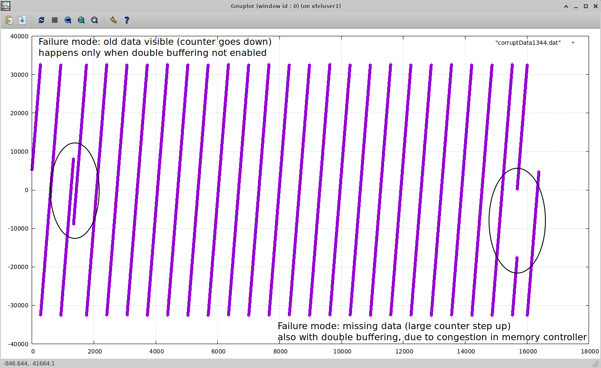

# Notes on how manual double buffer testing is done with CG's adapted test firmware

Firmware implements counter which goes up in steps of 100.
Value range is int16.
The counter values are written by fw to DMA in APP/DAQ0_BUF0 and APP_DAQ0_BUF1; channels 10,11,...
if double buffer feature is on, fw ping-pings between those two regions.

The fw writes at application trigger times.
They are defined by 125MHz / div, where div = (TIMING/DIVIDER_VALUE+1)
It makes most sense to set triggering frequency to about 10 Hz.
Then, fw has enough time to complete writing of the full DMA region, but also the value is high enough 
that we can actually see data curruption, if we turn off the double buffering (see below).
If we set triggering frequency too high, e.g. 100Hz, we will always see data corruption,
since fw has not enough time to complete a write, before next write is triggered.

## How to see data corruption with QtHardMon

- If not done already, initalize sis8300_ku_example_appliation with
  $./main.py -s 3 -c dwc8vm1 -t adc_dac_test
  
  This also creates dmap file include/temp.dmap
  If the script prints errors at the end, concerning pyqt version problems, ignore those.
  The application triggers with 10Hz.
  
- fire up QtHardMon:
  drothe@techlabcpullrfdev:~/projects/sis8300ku_example_application$ QtHardMon ./include/temp.dmap &
  Deactivate double buffering: 
  write DAQ/DOUBLE_BUF_ENA = 0, check active buffer DAQ/ACTIVE_BUF. 
  Enable again and check active buffer again until desired buffer is active.
  Then look at the _other_ buffer APP/DAQ0_BUFi, read channel 10 and plot.
  Press read again with random sleeps inbetween, until data corruption appears as irregularity in signal.
  
## How to run the automated test which checks data consistency

- build test application, copy it and deviceAccess lib over to test system

	  drothe@mskpcx29268 ~/C/b/D> cmake .; make -j16; cd tests
	  drothe@mskpcx29268 ~/C/b/D/tests> scp testDoubleBufferingHW doubleBufferHW.* drothe@techlabcpullrfdev:~/projects/sis8300ku_example_application 
	  drothe@mskpcx29268 ~/C/b/D/tests> scp /home/drothe/ChimeraTK/build/DeviceAccess-Debug/libChimeraTK-DeviceAccess.so.03.04  /lib/x86_64-linux-gnu/libboost_unit_test_framework.so.1.71.0   drothe@techlabcpullrfdev:~/projects/sis8300ku_example_application

- edit doubleBufferHW.dmap to point to real devices (like in temp.dmap) instead of shm dummies

  Note, if you take example_dma.mapp from CG's git, also fix first inconsistency of APP/DAQ0_BUF0 and APP_DAQ0_BUF1.
  Both should have fractional bits=0.

- make test find DeviceAccess and run it

  LD_LIBRARY_PATH=. ./testDoubleBufferingHW -l all
  
## Results
  
  testWithHardware0 finds data inconsistencies, as excepted without double buffering.
  However, with double buffering, testWithHardware1 still finds data corruption.
  This happens if data loss appears due to congestion in dma controller. It discards some of the data fw wants to write.
  This must be solved on the firmware side.
  A possible solution would be to prioritize write transfers (originating from fw) over read transfers (requested by sw).
  Still, if this is not done, a system might be safe, in case data writing and reading is so little that it does not cause
  congestion in the dma controller. This would require thorough testing.
  
  Output of "testWithHardware0":
  
		found data corruption at index 12695: step from -17378 to 96 while DAQ fifoStatus=0
		..
		historgram of wrong count-up values in data:
		 distance=-17274 :  19 times  <-- this is where old and new data is mixed
		 distance=17474 :  21 times   <-- this is where part of data was discarded
		 
  

